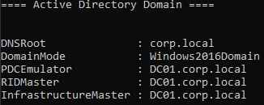
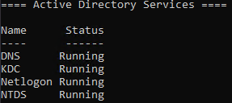
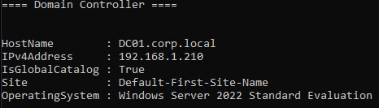
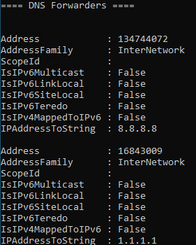
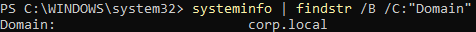
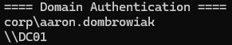
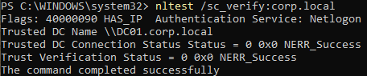
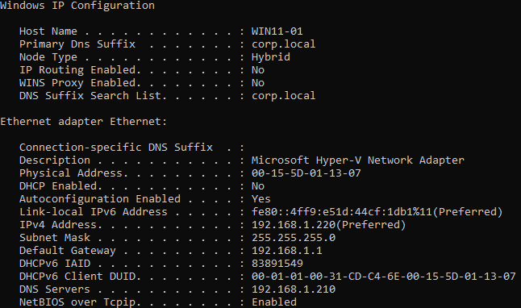
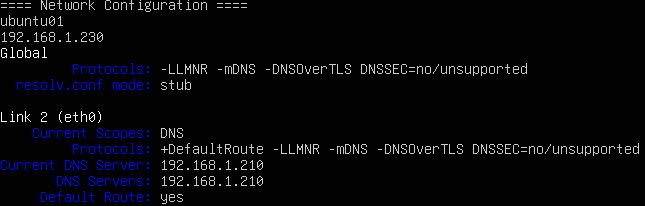
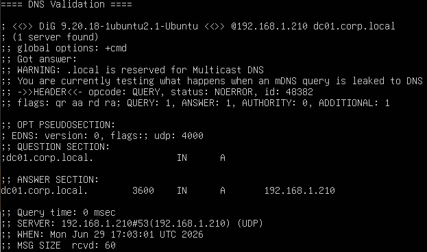

# Session 2 - Active Directory Foundation

**Date:** June 25, 2026

---

# Overview

The second session transformed the lab from a collection of standalone virtual machines into a centralized enterprise environment by deploying Active Directory Domain Services (AD DS), configuring Domain Name System (DNS), and establishing domain-based authentication.

Networking was standardized across all systems using static IP addressing, Windows 11 was joined to the newly created Active Directory domain, and the environment was validated to ensure proper communication between all systems.

This session established the identity infrastructure required for future Group Policy management, enterprise authentication, Linux integration, and cloud identity services.

---

# Objectives

- Configure static IP addressing
- Deploy Active Directory Domain Services (AD DS)
- Configure enterprise DNS
- Promote DC01 to a Domain Controller
- Create the Active Directory forest
- Join Windows 11 to the domain
- Validate Active Directory functionality
- Prepare the environment for hybrid identity integration

---

# Environment Before Changes

## Infrastructure

| System | Status |
|----------|:------:|
| DC01 | Windows Server 2022 |
| WIN11-01 | Windows 11 Pro for Workstations |
| UBUNTU01 | Ubuntu Server 26.04 LTS |

The virtual machines were deployed and operational but functioned as independent systems without centralized identity or authentication.

---

# Implementation

## Network Configuration

Static IPv4 addressing was configured across all virtual machines to provide predictable network communication and support enterprise infrastructure services.

| System | IP Address |
|----------|----------------|
| DC01 | 192.168.1.210 |
| WIN11-01 | 192.168.1.220 |
| UBUNTU01 | 192.168.1.230 |

Each system was configured with:

- Static IPv4 addressing
- Default gateway
- Enterprise DNS configuration

Network connectivity was verified between all systems.

---

## Ubuntu Server Networking

Ubuntu networking was configured using Netplan.

Configuration included:

- Static IP addressing
- DNS configuration
- Default gateway
- SSH validation
- Connectivity verification with Windows hosts

---

## Windows Networking

Windows networking was configured to support Active Directory communications.

Configuration included:

- Static IP addressing
- DNS configuration
- Windows Defender Firewall adjustments
- ICMP testing
- Bidirectional communication validation

Internet connectivity was restored by configuring:

- Default gateway
- DNS forwarders

---

## Active Directory Domain Services

Active Directory Domain Services (AD DS) and the DNS Server role were installed on DC01.

The initial Active Directory forest was created.

### Domain

```
corp.local
```

DC01 was promoted to the first Domain Controller for the environment.

---

## DNS Configuration

Enterprise DNS services were configured to support both internal Active Directory name resolution and external Internet access.

DNS Forwarders:

- Google Public DNS (8.8.8.8)
- Cloudflare DNS (1.1.1.1)

This configuration allows DC01 to remain authoritative for the Active Directory domain while forwarding external queries to public DNS providers.

---

## Domain Validation

The Active Directory deployment was validated using multiple administrative tools.

Validation included:

- Get-ADDomain
- Get-ADForest
- dcdiag
- Resolve-DnsName
- nltest

Successful validation confirmed:

- Domain Controller health
- DNS functionality
- Kerberos services
- LDAP services
- Global Catalog availability
- Secure domain communications

---

## Windows 11 Domain Join

WIN11-01 was successfully joined to the Active Directory domain.

Domain:

```
corp.local
```

Validation confirmed:

- Domain authentication
- Domain Controller discovery
- Secure channel establishment
- Active Directory communication

---

# Validation

The following items were successfully validated:

- Static networking operational
- Network connectivity between all virtual machines
- Internet connectivity restored
- Active Directory Domain Services operational
- Enterprise DNS functioning correctly
- Domain Controller health verified
- Windows 11 successfully joined to the domain
- Kerberos authentication operational
- LDAP services operational
- Secure domain communications established

---

# Challenges Encountered

## Windows Defender Firewall

ICMP traffic between Windows systems was initially blocked despite correct network configuration.

Connectivity was restored after enabling the required inbound firewall rules.

---

## Ubuntu Netplan Configuration

Ubuntu Server required manual Netplan configuration for static networking.

Proper YAML formatting and indentation were required before the configuration would apply successfully.

---

## Network Design

The original lab was deployed on an isolated subnet (192.168.100.0/24).

Because an External Hyper-V virtual switch was being used, Internet connectivity required migration to the physical network subnet (192.168.1.0/24).

The environment was updated by:

- Migrating all virtual machines
- Configuring default gateways
- Configuring DNS forwarders

This preserved Active Directory functionality while providing Internet access.

---

# Lessons Learned

- Active Directory relies heavily on DNS for authentication and service discovery.
- Domain Controllers should provide authoritative DNS while forwarding external queries to public DNS providers.
- Windows Defender Firewall should always be considered during network troubleshooting.
- Static IP configurations should include a default gateway when Internet access is required.
- Hyper-V External Virtual Switches bridge virtual machines directly onto the physical network, making proper subnet planning essential.
- Incremental validation during deployment simplifies troubleshooting and confirms successful implementation.

---

# Environment After Changes

| Component | Status |
|----------|:------:|
| Static IP Addressing | ✅ Complete |
| Enterprise DNS | ✅ Operational |
| Active Directory Domain Services | ✅ Operational |
| Active Directory Forest | ✅ Created |
| Domain Controller | ✅ Operational |
| Windows 11 Domain Join | ✅ Complete |
| Kerberos Services | ✅ Operational |
| LDAP Services | ✅ Operational |
| Enterprise Authentication | ✅ Operational |

---

# Next Steps

Session 3 will focus on implementing enterprise identity management by:

- Designing an Organizational Unit (OU) hierarchy
- Creating enterprise user accounts
- Implementing Role-Based Access Control (RBAC)
- Creating enterprise security groups
- Deploying baseline Group Policy Objects (GPOs)
- Joining Ubuntu Server to Active Directory
- Validating hybrid Windows/Linux authentication

---

# Screenshots

## Active Directory Domain

Validation of the Active Directory domain following the promotion of DC01 to the first domain controller in the forest.



---

## Active Directory Services

Verification that the core Active Directory services are running correctly on the domain controller.



---

## Domain Controller Information

Validation of the Active Directory Domain Controller, including hostname, IP address, Global Catalog status, site assignment, and operating system.



---

## DNS Forwarders

Configuration of DNS forwarders to provide external name resolution while maintaining authoritative DNS services for the Active Directory domain.



---

## Windows Domain Join

Verification that the Windows 11 workstation successfully joined the Active Directory domain.



---

## Domain Authentication

Validation that the workstation is authenticated using a domain account and communicating with the domain controller.



---

## Secure Channel Validation

Verification of the secure trust relationship between the Windows 11 workstation and the Active Directory domain.



---

## Windows Network Configuration

Validation of the workstation's network configuration, including static IP addressing, DNS server assignment, and domain suffix.



---

## Ubuntu Network Configuration

Verification of Ubuntu Server network configuration, including hostname, IP address, DNS configuration, and default route.



---

## Ubuntu DNS Validation

Validation that Ubuntu Server successfully resolves Active Directory DNS records using the domain controller.

