# Session 3 - Enterprise Identity & Hybrid Linux Integration

**Date:** June 29, 2026

---

# Overview

The third session expanded the Active Directory environment into a fully functional enterprise identity platform. The focus shifted from infrastructure deployment to identity management by implementing an enterprise Organizational Unit (OU) structure, Role-Based Access Control (RBAC), security groups, baseline Group Policy Objects (GPOs), and centralized authentication across both Windows and Linux systems.

Ubuntu Server was integrated with Active Directory using Kerberos, LDAP, SSSD, and PAM, creating a hybrid identity environment where Windows and Linux systems authenticate against the same centralized directory.

---

# Objectives

- Design an enterprise Organizational Unit (OU) structure
- Create enterprise user accounts
- Create separate administrative accounts
- Implement Role-Based Access Control (RBAC)
- Create enterprise security groups
- Configure baseline Group Policy Objects (GPOs)
- Join Ubuntu Server to Active Directory
- Validate centralized authentication across Windows and Linux

---

# Environment Before Changes

## Active Directory

- Domain: `corp.local`
- Active Directory Domain Services operational
- DNS operational
- Windows 11 joined to the domain

## Virtual Machines

| System | Role |
|----------|------|
| DC01 | Domain Controller |
| WIN11-01 | Domain-Joined Workstation |
| UBUNTU01 | Standalone Linux Server |

Ubuntu Server was still operating independently and had not yet been integrated into Active Directory.

---

# Implementation

## Organizational Unit Design

A structured Organizational Unit (OU) hierarchy was implemented to support enterprise administration, delegated management, and targeted Group Policy deployment.

### Organizational Units

```
corp.local
│
├── Admin
├── Computers
├── Groups
├── Servers
├── Service Accounts
├── Users
└── Workstations
```

Separating objects by function simplifies administration and provides flexibility for future Group Policy expansion.

---

## Enterprise User Accounts

Standard domain user accounts were created for daily activities.

Administrative accounts were created separately to support the principle of least privilege by separating administrative tasks from normal user activity.

Example:

- Standard User
  - Aaron Dombrowiak

- Administrative User
  - adm-aaron.dombrowiak

This mirrors enterprise identity management practices where administrative credentials are only used when elevated privileges are required.

---

## Role-Based Access Control (RBAC)

Security was organized using Role-Based Access Control.

Enterprise security groups were created to assign permissions based on job function instead of assigning permissions directly to user accounts.

Example security groups included:

- GG-DomainAdmins
- GG-ITAdmins
- GG-WorkstationAdmins
- GG-LinuxAdmins
- GG-ServerAdmins

This design simplifies permission management and improves scalability.

---

## Group Policy

Baseline Group Policy Objects were configured to establish centralized management of domain-joined Windows systems.

Policies were applied to validate:

- Active Directory communication
- Domain authentication
- Organizational Unit targeting
- Group Policy processing

Policy application was verified using:

- gpupdate
- gpresult

---

## Ubuntu Active Directory Integration

Ubuntu Server was integrated into Active Directory to demonstrate hybrid identity management.

The following technologies were implemented:

- realmd
- Kerberos
- LDAP
- SSSD
- PAM
- adcli

Ubuntu successfully joined the Active Directory domain:

```
corp.local
```

---

## Linux Authentication

Centralized authentication was validated by successfully logging into Ubuntu using an Active Directory user account.

Additional configuration included:

- Automatic home directory creation
- PAM integration
- SSSD identity lookup
- Kerberos authentication

This allows Linux systems to authenticate directly against Active Directory while maintaining centralized identity management.

---

# Validation

The following items were successfully validated:

- Organizational Unit hierarchy created
- Enterprise user accounts operational
- Administrative accounts operational
- Security groups functioning correctly
- Role-Based Access Control implemented
- Group Policy successfully applied
- Windows authentication validated
- Ubuntu successfully joined to Active Directory
- Kerberos authentication operational
- LDAP communication operational
- SSSD operational
- PAM automatic home directory creation operational
- Centralized Windows and Linux authentication verified

---

# Challenges Encountered

## Hyper-V Enhanced Session Authentication

Logging into the domain from the Hyper-V Enhanced Session required additional troubleshooting before domain credentials were accepted successfully.

---

## Group Policy Verification

Running `gpresult /scope computer /r` required administrative privileges.

Validation was completed using the dedicated administrative account.

---

## Ubuntu Domain Join

Ubuntu initially failed to discover the Active Directory realm.

Troubleshooting identified DNS and Kerberos discovery issues that were resolved through:

- DNS verification
- Realm discovery validation
- SSSD configuration
- Active Directory service validation

---

## Automatic Home Directory Provisioning

Initial Active Directory logins authenticated successfully but failed to create user home directories.

PAM was updated to automatically provision home directories during first-time logins, completing the Linux identity integration.

---

# Lessons Learned

- Enterprise Organizational Unit design simplifies administration and future scalability.
- Separating standard and administrative accounts enforces the principle of least privilege.
- Security groups provide a scalable method for implementing Role-Based Access Control.
- Active Directory integration on Linux depends heavily on DNS, Kerberos, LDAP, and SSSD.
- Centralized identity management reduces administrative overhead across mixed operating systems.
- Validation at each deployment stage significantly reduces troubleshooting complexity.

---

# Environment After Changes

| Component | Status |
|----------|:------:|
| Enterprise OU Structure | ✅ Complete |
| Enterprise User Accounts | ✅ Complete |
| Administrative Accounts | ✅ Complete |
| Role-Based Access Control | ✅ Complete |
| Security Groups | ✅ Complete |
| Baseline Group Policy | ✅ Complete |
| Windows Authentication | ✅ Operational |
| Ubuntu Active Directory Join | ✅ Complete |
| Kerberos Authentication | ✅ Operational |
| LDAP Integration | ✅ Operational |
| SSSD | ✅ Operational |
| PAM Home Directory Creation | ✅ Operational |
| Hybrid Windows/Linux Identity | ✅ Operational |

---

# Next Steps

Session 4 will focus on enterprise Linux administration and hardening by implementing:

- Active Directory-based sudo administration
- Linux administrator security groups
- SSH authentication using Active Directory
- SSH access control
- Authentication logging
- Enterprise Linux hardening
- Security auditing

---

# Screenshots

## Organizational Unit Structure

The enterprise Organizational Unit (OU) hierarchy used to logically separate administrative accounts, users, computers, groups, and service accounts within the Active Directory domain.

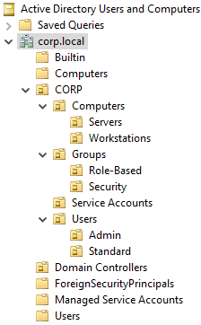

---

## Enterprise Security Groups

Role-Based Access Control (RBAC) security groups created to delegate administrative responsibilities while following the principle of least privilege.

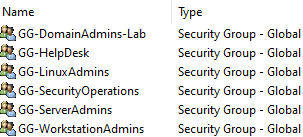

---

## Administrative User Account

Validation of the delegated Active Directory administrative account used throughout the lab.

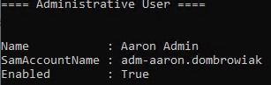

---

## Standard User Account

Validation of the standard Active Directory user account used for day-to-day authentication and testing.

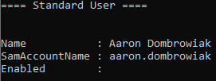

---

## Administrative Group Membership

Verification of the delegated administrative account's security group memberships.


---

## Domain Admins Group Membership

Validation of the Domain Admins group membership demonstrating delegated administrative access.


---

## Group Policy Link

Verification that the workstation baseline Group Policy Object (GPO) is linked to the appropriate Organizational Unit.

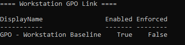

---

## Group Policy Results

Validation that the Windows 11 workstation successfully received and applied the assigned Group Policy Objects.

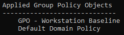

---

## Active Directory Realm Discovery

Verification that Ubuntu Server successfully discovered the Active Directory realm and identified the required identity services.

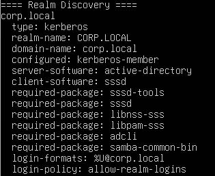

---

## Active Directory Realm Configuration

Validation of the Active Directory realm configuration following the successful domain join.

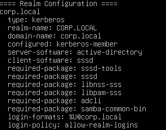

---

## Hybrid Identity Validation

Verification that Ubuntu Server successfully resolves Active Directory users through SSSD and centralized identity services.

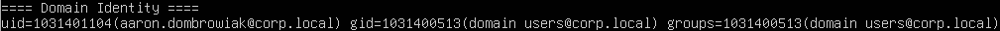

---

## Active Directory Domain Login

Successful authentication to Ubuntu Server using an Active Directory domain account with automatic home directory creation.

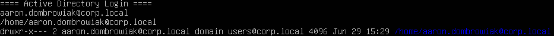

---

## SSSD Service Status

Verification that the System Security Services Daemon (SSSD) is running and providing centralized authentication services.

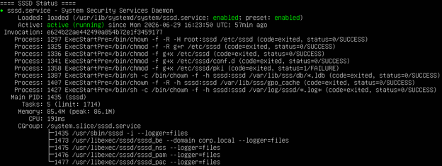

---

## Kerberos Authentication

Validation of Kerberos authentication through the successful acquisition of a Ticket Granting Ticket (TGT) from the Active Directory domain.

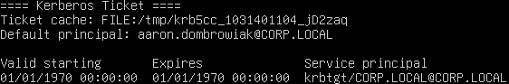