# Session 4 - Enterprise Linux Administration & Hybrid Identity Validation

**Date:** July 2, 2026

---

# Overview

The fourth session focused on enterprise Linux administration by validating and troubleshooting the hybrid identity environment established during the previous session. The objective was to ensure Ubuntu Server could reliably communicate with Active Directory using enterprise authentication services including DNS, Kerberos, LDAP, and SSSD.

During implementation, several infrastructure issues were identified involving Active Directory DNS and Ubuntu's DNS search domain configuration. Through systematic troubleshooting, hybrid identity services were fully restored, allowing Ubuntu Server to successfully discover the Active Directory Domain Controller, resolve enterprise users, and validate centralized authentication across the hybrid Windows and Linux environment.

---

# Objectives

- Validate enterprise hybrid identity services
- Verify Active Directory DNS functionality
- Troubleshoot SSSD communication
- Validate Kerberos and LDAP connectivity
- Configure enterprise DNS search domains using Netplan
- Restore Active Directory user resolution
- Validate centralized authentication across Windows and Linux

---

# Environment Before Changes

## Active Directory

- Domain: `corp.local`
- Active Directory Domain Services operational
- DNS installed
- Windows authentication operational
- Ubuntu previously joined to the domain

## Virtual Machines

| System | Role |
|----------|------|
| DC01 | Domain Controller |
| WIN11-01 | Domain-Joined Workstation |
| UBUNTU01 | Domain-Joined Linux Server |

Although Ubuntu had successfully joined the Active Directory domain during the previous session, SSSD was unable to communicate with the Domain Controller and Active Directory user resolution was no longer functioning correctly.

---

# Implementation

## Enterprise Identity Validation

The session began by validating the existing hybrid identity deployment.

Initial testing confirmed that Ubuntu remained joined to the Active Directory domain; however, additional enterprise users could no longer be resolved through SSSD. Domain Controller discovery also reported the Active Directory domain as Offline despite successful domain membership.

This indicated that the issue existed within the enterprise identity infrastructure rather than the original domain join process.

---

## Active Directory DNS Validation

Enterprise DNS functionality was validated on the Domain Controller to verify that Active Directory service discovery remained operational.

During troubleshooting, DNS management tools initially failed to enumerate Active Directory zones and LDAP SRV records could not be resolved.

Additional validation confirmed DNS service configuration required remediation before enterprise clients could properly discover Active Directory services.

Following repair and validation, DNS functionality was restored.

Validation confirmed:

- Active Directory DNS zones operational
- LDAP SRV records successfully registered
- Domain Controller host records available
- Enterprise DNS responding correctly

This restored proper Active Directory service discovery for enterprise clients.

---

## Ubuntu Network Configuration

Following DNS validation, troubleshooting shifted to Ubuntu Server.

Although the correct enterprise DNS server had been configured, additional investigation identified that the required Active Directory DNS search domain had not been configured within the Netplan network configuration.

The existing configuration specified only the enterprise DNS server.

The configuration was updated to include:

```yaml
nameservers:
  addresses:
    - 192.168.1.210
  search:
    - corp.local
```

The updated configuration was applied using Netplan, allowing Ubuntu's system resolver to correctly identify and discover Active Directory resources.

---

## SSSD Recovery

Following the Netplan update, the System Security Services Daemon (SSSD) was restarted to establish new communication with Active Directory.

SSSD immediately transitioned from an Offline state to an Online state and successfully discovered the Domain Controller.

Validation confirmed:

- Active Directory Domain Controller discovered
- SSSD Online
- Enterprise identity services restored
- Active Directory communication operational

This confirmed successful recovery of enterprise identity services.

---

## Hybrid Identity Validation

Following restoration of enterprise identity services, validation testing confirmed successful communication between Ubuntu Server and Active Directory.

Multiple enterprise accounts were successfully resolved using SSSD including both standard user accounts and delegated administrative accounts.

Enterprise DNS host resolution, Domain Controller discovery, and centralized authentication were all successfully validated.

The hybrid identity environment was fully operational.

---

# Validation

The following items were successfully validated:

- Active Directory DNS operational
- DNS zones successfully enumerated
- LDAP SRV records operational
- Domain Controller host records validated
- Enterprise DNS resolution operational
- Ubuntu Netplan DNS configuration updated
- DNS search domain configured
- SSSD successfully communicating with Active Directory
- Active Directory Domain Controller discovery operational
- Standard Active Directory user resolution operational
- Administrative Active Directory user resolution operational
- Hybrid Windows/Linux identity fully operational

---

# Challenges Encountered

## Active Directory DNS Validation

Initial troubleshooting indicated that Ubuntu Server could no longer discover Active Directory services despite remaining joined to the domain.

Further investigation identified inconsistent behavior within the Domain Controller DNS service. DNS management tools were initially unable to enumerate Active Directory zones, and LDAP SRV record lookups failed.

Additional validation confirmed the issue originated within the Active Directory DNS infrastructure rather than Ubuntu itself. Following DNS service validation and system updates, Active Directory DNS functionality returned to a healthy operational state, restoring proper enterprise service discovery.

---

## SSSD Offline Status

Although Ubuntu Server remained joined to the Active Directory domain, SSSD continually reported the domain as Offline.

Extensive troubleshooting was performed across multiple enterprise authentication components including:

- DNS
- Kerberos
- LDAP
- SSSD
- Active Directory
- systemd-resolved
- Netplan

Each service was independently validated to isolate the root cause rather than rebuilding the domain join.

---

## Ubuntu DNS Search Domain

Enterprise DNS testing produced inconsistent results.

Direct DNS queries successfully resolved Active Directory resources while Linux applications relying on the system resolver continued to fail.

Reviewing the Netplan configuration identified the missing Active Directory DNS search domain.

Although the enterprise DNS server had been configured correctly, Ubuntu could not properly associate enterprise DNS requests with the Active Directory namespace.

Adding the `corp.local` search domain immediately restored enterprise name resolution, allowing SSSD to successfully discover the Domain Controller and resume normal operation.

---

# Lessons Learned

- Enterprise identity services rely on DNS before authentication can occur.
- Successful domain membership alone does not guarantee healthy hybrid identity services.
- Direct DNS queries and Linux system resolver queries should both be validated during enterprise troubleshooting.
- Active Directory DNS health should always be verified before troubleshooting Kerberos, LDAP, or SSSD.
- Systematic troubleshooting of individual infrastructure components is significantly more effective than rebuilding working configurations.
- Proper Netplan DNS search domain configuration is essential for reliable Active Directory integration on Linux.

---

# Environment After Changes

| Component | Status |
|----------|:------:|
| Active Directory DNS | ✅ Operational |
| LDAP SRV Records | ✅ Operational |
| Enterprise DNS Resolution | ✅ Operational |
| Ubuntu Netplan Configuration | ✅ Updated |
| DNS Search Domain | ✅ Configured |
| SSSD | ✅ Online |
| Domain Controller Discovery | ✅ Operational |
| Standard User Resolution | ✅ Operational |
| Administrative User Resolution | ✅ Operational |
| Hybrid Windows/Linux Identity | ✅ Operational |

---

# Next Steps

Session 5 will focus on enterprise Linux security administration by implementing:

- Active Directory-based Linux privilege delegation
- Enterprise sudo administration
- Linux administrative security groups
- SSH hardening
- SSH access controls
- Enterprise firewall configuration
- Authentication auditing
- Linux security hardening

---

# Screenshots

## Active Directory Realm Configuration

Verification that Ubuntu Server remains successfully joined to the Active Directory domain.

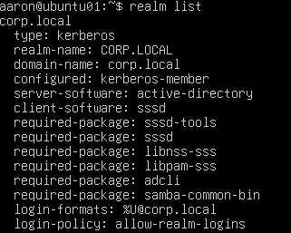

---

## DNS Search Domain

Validation that Ubuntu's system resolver is configured with the Active Directory DNS search domain.

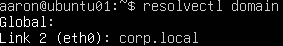

---

## SSSD Status

Verification that the System Security Services Daemon (SSSD) successfully established communication with the Active Directory Domain Controller.

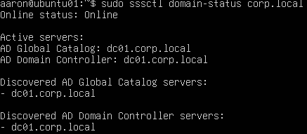

---

## Standard User Resolution

Validation that Ubuntu Server successfully resolves a standard Active Directory user account.

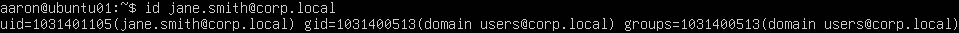

---

## Administrative User Resolution

Validation that Ubuntu Server successfully resolves a delegated Active Directory administrative account.

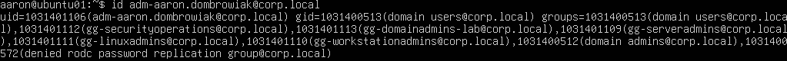

---

## Enterprise DNS Host Resolution

Verification that Ubuntu successfully resolves the Active Directory Domain Controller using enterprise DNS.

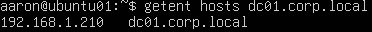

---

## Domain Controller Connectivity

Validation of successful network connectivity between Ubuntu Server and the Active Directory Domain Controller.

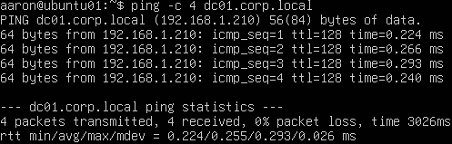

---

## Netplan Configuration

Verification of the updated Netplan configuration including the Active Directory DNS search domain.

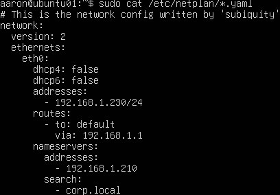

---

## SSSD Configuration

Validation of the enterprise SSSD configuration used for centralized Active Directory authentication.

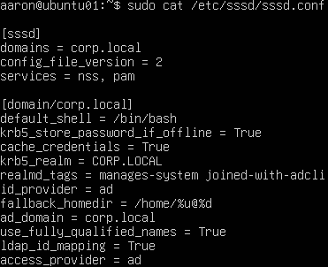

---

## Kerberos Configuration

Verification of the Kerberos realm configuration supporting enterprise authentication.

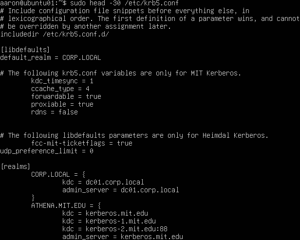

---

## Hybrid Identity Validation

Validation that SSSD successfully communicates with the Active Directory Domain Controller while resolving enterprise user accounts.

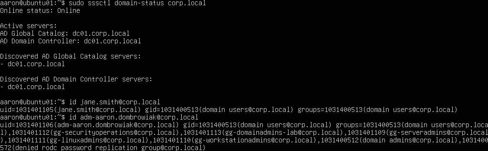

---

## Active Directory DNS Zones

Verification that the Domain Controller successfully hosts the required Active Directory DNS zones.

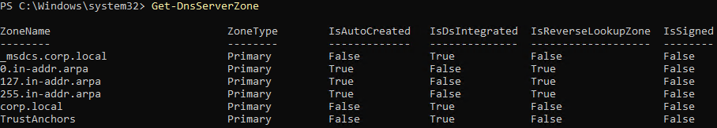

---

## LDAP SRV Records

Validation that Active Directory LDAP service records are correctly registered within DNS.

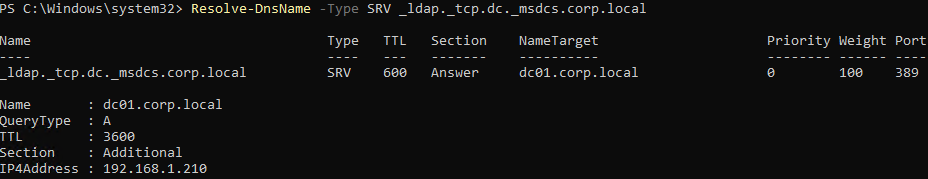

---

## Domain Controller Host Record

Verification that the Domain Controller host record resolves correctly through Active Directory DNS.

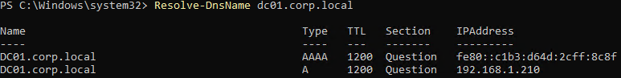

---

## Active Directory DNS Diagnostics

Validation that Active Directory DNS health checks completed successfully following troubleshooting and remediation.

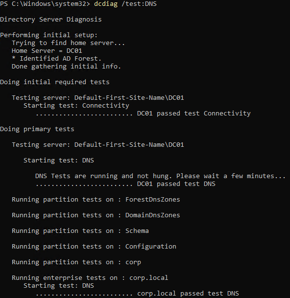